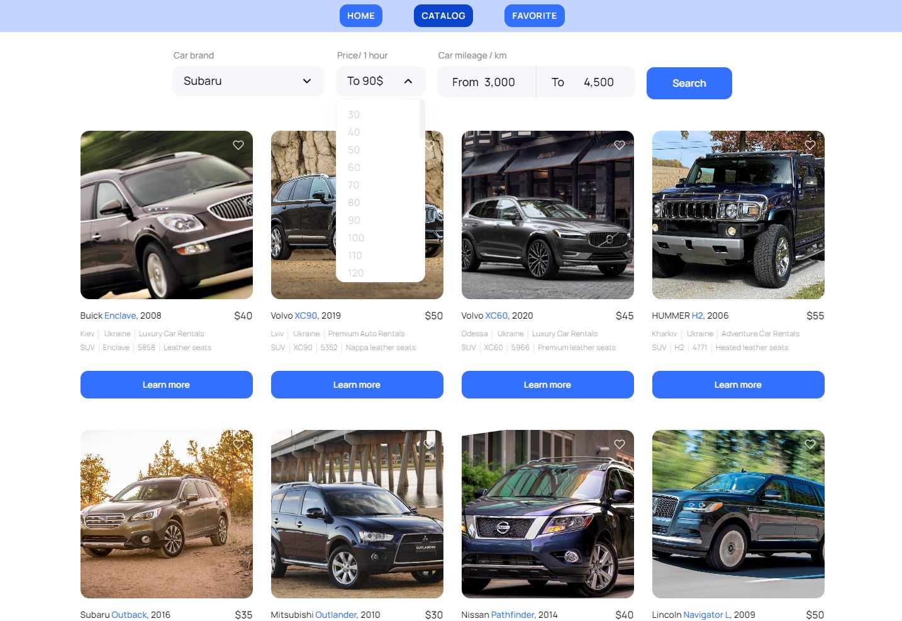
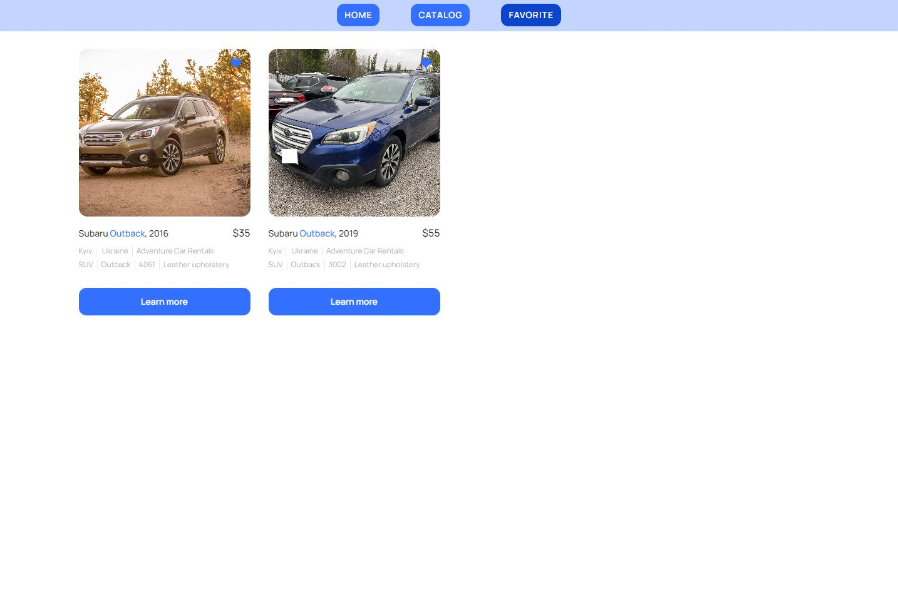

# Rent Car App

Ride into your dreams with [**Dream car**](https://igormushk.github.io/rent-car/)

## About Website
This website is built on the React framework, your automobile companion provides simple and convenient way to rent cars. . 

- **Home**:


- **Catalog**:


- **Favorites**:


## Used Libraries

### Frontend

- React.js
- React Router
- Redux Toolkit
- Redux Persist
- Axios
- styled-components
- Material UI
- @emotion/styled
- react-loader-spinner

### Backend

- mockAPI

## Getting Started

1. Clone the repository:
```
git clone https://github.com/IgorMushk/rent-car.git
```
2. Navigate to the project directory:
```
cd rent-car
```
3. Install dependencies:
```
npm install
```
4. Run the application:
```
npm start
```
